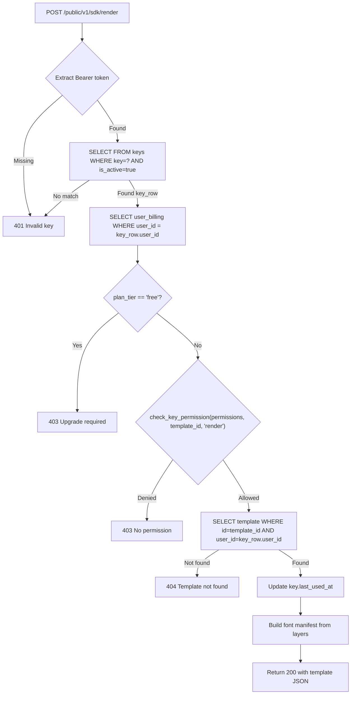

# 100PrintsWithMe Browser SDK — Implementation Plan (v3)

## Problem Statement

Third-party developers need a JavaScript SDK to render 100Prints templates in their own apps. The SDK authenticates via a **publishable key** (visible in browser), fetches template data from the backend, and renders entirely client-side using the flatten-image pipeline.

**No changes to the existing 100Prints React frontend.**

---

## User Review Required

> [!IMPORTANT]
> **Generic `keys` Table.** Instead of an SDK-specific table, this plan creates a flexible `keys` table that supports all future key types: SDK, WordPress plugin, Shopify app, server-to-server API, etc. The `key_type` column differentiates them, and the `permissions` JSONB column handles per-key scoping.

> [!WARNING]
> **Plan Gating.** The endpoint hard-rejects `plan_tier == "free"`. Only paid plans (pro, enterprise, or any future tier) can use SDK keys. Is this correct, or should there be a trial/sandbox mode?

> [!IMPORTANT]
> **Relationship with existing `api_secret_key`.** The User model already has an [api_secret_key](file:///c:/fun/100PrintsApi/app/db/models.py#L17) field used by the [/public/v1/generate/accurate](file:///c:/fun/100PrintsApi/app/api/v1/public/generate.py#L291) endpoint via [verify_api_key()](file:///c:/fun/100PrintsApi/app/api/dependencies.py#L42-L52). The new `keys` table is **separate** — it does NOT replace `api_secret_key`. Both systems coexist.

---

## Open Questions

> [!IMPORTANT]
> 1. **Rate limit scaling** — Flat 5 req/min for all plans, or tiered (pro=5, enterprise=20)?
> 2. **Max keys per user** — Should there be a cap (e.g., pro=10 keys, enterprise=50)?
> 3. **Key management UI** — Out of scope for this plan, but where will it live? Dashboard? Developer page?
> 4. **npm package name** — `@100printswithme/browser-sdk`, `@100printswithme/sdk`, or `100prints-sdk`?

---

## 1. The `keys` Table

### Schema

```python
class Key(Base):
    __tablename__ = "keys"
    
    id          = Column(String, primary_key=True, default=lambda: str(uuid.uuid4()))
    user_id     = Column(String, ForeignKey("users.id", ondelete="CASCADE"), nullable=False, index=True)
    
    # ── Identity ──
    key         = Column(String, unique=True, index=True, nullable=False,
                         default=lambda: f"pk_live_{secrets.token_urlsafe(24)}")
    key_type    = Column(String, nullable=False, default="sdk")
    label       = Column(String, nullable=True)        # "My WordPress Site", "Production SDK"
    
    # ── Permissions (JSONB — flexible, extensible) ──
    permissions = Column(JSONB, nullable=False, default=lambda: {
        "templates": "all",
        "actions": ["render", "render_bulk", "preview"]
    })
    
    # ── Status ──
    is_active   = Column(Boolean, default=True)
    
    # ── Timestamps ──
    created_at  = Column(DateTime, default=datetime.datetime.utcnow)
    last_used_at = Column(DateTime, nullable=True)
```

### `key_type` Values

| Value | Use Case | Key Prefix |
|-------|----------|------------|
| `"sdk"` | Browser SDK for third-party developers | `pk_live_` |
| `"wordpress"` | WordPress plugin (future) | `pk_wp_` |
| `"shopify"` | Shopify app (future) | `pk_shop_` |
| `"server"` | Server-to-server integrations (future) | `sk_live_` |

The prefix is purely cosmetic for developer convenience — the backend matches on the full `key` column regardless.

### `permissions` JSONB Structure

The `permissions` column is a JSON object. This is more extensible than a flat string column — new permission dimensions can be added without migrations.

**Example: Access to all templates**
```json
{
  "templates": "all",
  "actions": ["render", "render_bulk", "preview"]
}
```

**Example: Scoped to specific templates**
```json
{
  "templates": ["tmpl_abc123", "tmpl_def456"],
  "actions": ["render", "preview"]
}
```

**Example: WordPress plugin key (future)**
```json
{
  "templates": "all",
  "actions": ["render", "render_bulk"],
  "domains": ["mysite.com", "*.mysite.com"]
}
```

**Example: Read-only preview key (future)**
```json
{
  "templates": ["tmpl_abc123"],
  "actions": ["preview"]
}
```

### Permission Validation Logic (Backend)

```python
def check_key_permission(permissions: dict, template_id: str, action: str) -> bool:
    """
    Validates whether a key's permissions allow the requested action on the requested template.
    """
    # Check action permission
    allowed_actions = permissions.get("actions", [])
    if action not in allowed_actions:
        return False
    
    # Check template permission
    templates = permissions.get("templates", [])
    if templates == "all":
        return True
    if isinstance(templates, list) and template_id in templates:
        return True
    
    return False
```

### Why JSONB over a flat `permission` string?

| Flat string (`"render"`) | JSONB |
|---|---|
| Can only express one dimension | Multiple dimensions: templates, actions, domains, rate limits |
| Adding new permission types requires new columns or migrations | Add new keys to the JSON — zero migrations |
| Can't scope to specific templates without a separate column | `"templates": ["id1", "id2"]` or `"templates": "all"` in one field |
| WordPress/Shopify will need different permission shapes | Same column, different JSON shapes per `key_type` |

---

## 2. Backend Endpoint

### `POST /public/v1/sdk/render`

New file: `app/api/v1/public/sdk.py`

**Request:**
```
Headers:
  Authorization: Bearer pk_live_xxxxxxxxx

Body:
  { "template_id": "tmpl_abc123" }
```

**Response (200):**
```json
{
  "template_data": { ... },
  "dimensions": { "width": 856, "height": 540 },
  "backgroundColor": "#ffffff",
  "frontLayers": [ ... ],
  "backLayers": [ ... ],
  "fontManifest": [
    { "family": "Inter", "weight": 400, "url": "https://..." }
  ],
  "sample_data": { "headers": [...], "rows": [...] }
}
```

**Error responses:**
| Status | Condition |
|--------|-----------|
| 401 | Key not found, revoked (`is_active=false`), or missing header |
| 403 | `plan_tier == "free"` — must upgrade |
| 403 | Key doesn't have permission for this `template_id` |
| 403 | Key doesn't have the required action (`"render"`) |
| 404 | Template not found (or not owned by key's user) |
| 429 | Rate limit exceeded (5 req/min per key) |

### Endpoint Flow



### Rate Limiting

```python
from slowapi import Limiter

# Use the SDK key itself as the rate limit identifier (not IP)
def get_sdk_key_from_request(request: Request) -> str:
    auth = request.headers.get("Authorization", "")
    if auth.startswith("Bearer "):
        return auth[7:]
    return request.client.host  # fallback to IP

sdk_limiter = Limiter(key_func=get_sdk_key_from_request)

@router.post("/render")
@sdk_limiter.limit("5/minute")
async def sdk_render(...):
    ...
```

This limits per SDK key, not per IP. So a developer with 3 keys can make 15 req/min total (5 per key).

---

## 3. SDK Public API

```typescript
import { BrowserSDK } from '@100printswithme/browser-sdk';

const sdk = new BrowserSDK({
  key: 'pk_live_xxxxxxxxx',                          // publishable key
  baseUrl: 'https://api.100printswith.me',            // optional
});

// ── Single Render ──
const result = await sdk.render({
  templateId: 'template_abc123',
  payload: { name: 'Rishabh Dev', email: 'r@example.com' },
  format: 'pdf',
  quality: 'high',
  side: 'front',
});
// → RenderResult { blob: Blob, mimeType: string, sizeKB: number }

// ── Bulk Render ──
const bulk = await sdk.renderBulk({
  templateId: 'template_abc123',
  rows: [
    { name: 'Alice', email: 'alice@example.com' },
    { name: 'Bob', email: 'bob@example.com' },
  ],
  format: 'pdf',
  quality: 'high',
  mode: 'merged',
  onProgress: (current, total, name) => console.log(`${current}/${total}: ${name}`),
});
// → BulkRenderResult { blob: Blob, filename: string, sizeKB: number }

// ── Preview ──
const canvas = await sdk.preview({
  templateId: 'template_abc123',
  payload: { name: 'Preview' },
  container: document.getElementById('preview-box'),
  scale: 1,
});
// → HTMLCanvasElement

sdk.destroy();
```

---

## 4. SDK Architecture & Folder Structure

```
c:\fun\sdk\
├── package.json
├── tsconfig.json
├── vite.config.ts
├── src/
│   ├── index.ts                    # Exports BrowserSDK + types
│   ├── browser-sdk.ts              # Facade class
│   ├── api/
│   │   ├── sdk-client.ts           # fetch() → POST /public/v1/sdk/render
│   │   └── types.ts
│   ├── templates/
│   │   ├── template-cache.ts       # In-memory, 5 min TTL
│   │   └── types.ts                # Layer, DocumentTemplate, Logic types
│   ├── render/
│   │   ├── render-engine.ts        # Headless Konva → single record
│   │   ├── bulk-renderer.ts        # Chunked loop with GC yields
│   │   ├── layer-renderers.ts      # Per-type renderers
│   │   ├── variable-resolver.ts    # {{var}} interpolation
│   │   ├── logic-evaluator.ts      # Smart logic engine
│   │   └── konva-helpers.ts        # Gradient + transform helpers
│   ├── fonts/
│   │   ├── font-loader.ts          # Fetch + OPFS cache + WOFF2 decompress
│   │   └── font-registry.ts        # Built-in font URL map
│   ├── assets/
│   │   ├── asset-loader.ts         # Image preloading
│   │   ├── qr-generator.ts         # QR via qrcode (lazy)
│   │   ├── barcode-generator.ts    # Barcode via jsbarcode (lazy)
│   │   └── svg-rasterizer.ts       # SVG → Canvas via canvg (lazy)
│   ├── export/
│   │   ├── pdf-exporter.ts         # jsPDF wrapper
│   │   └── png-exporter.ts         # dataURL → Blob
│   ├── utils/
│   │   ├── generate-chart-svg.ts   # Copy from 100Prints
│   │   ├── generate-table-svg.ts   # Copy from 100Prints
│   │   ├── text-svg-generator.ts   # Copy from 100Prints
│   │   └── helpers.ts
│   └── types/
│       ├── index.ts
│       ├── sdk-options.ts
│       └── render-options.ts
└── examples/
    └── vanilla/index.html
```

### Rendering: Flatten-Image Only

The SDK uses **exclusively** the raster path from [renderOrchestrator.ts](file:///c:/fun/100Prints/src/services/renderOrchestrator.ts):

```
Konva headless Stage → per-layer rendering → stage.toDataURL() → jsPDF or PNG Blob
```

No vector PDF. No WASM. No WebWorker. Code is extracted (copied) from these source files:

| Source | SDK Target | What |
|--------|-----------|------|
| [renderOrchestrator.ts:59-702](file:///c:/fun/100Prints/src/services/renderOrchestrator.ts#L59-L702) | `render-engine.ts` + `layer-renderers.ts` | All layer renderers + single-record render |
| [renderOrchestrator.ts:732-933](file:///c:/fun/100Prints/src/services/renderOrchestrator.ts#L732-L933) | `bulk-renderer.ts` | Chunked loop with GC yields |
| [logicEvaluator.tsx](file:///c:/fun/100Prints/src/services/logicEvaluator.tsx) | `logic-evaluator.ts` | Smart logic engine (direct copy) |
| [fontMap.ts](file:///c:/fun/100Prints/src/services/fontMap.ts) | `font-loader.ts` + `font-registry.ts` | Font fetch + OPFS cache |
| [generateChartSvg.ts](file:///c:/fun/100Prints/src/utils/generateChartSvg.ts) | `generate-chart-svg.ts` | Direct copy |
| [generateTableSvg.ts](file:///c:/fun/100Prints/src/utils/generateTableSvg.ts) | `generate-table-svg.ts` | Direct copy |
| [textSvgGenerator.tsx](file:///c:/fun/100Prints/src/components/textSvgGenerator.tsx) | `text-svg-generator.ts` | Rename .tsx → .ts |

---

## 5. Proposed Changes Summary

### Backend (`c:\fun\100PrintsApi`)

#### [MODIFY] [app/db/models.py](file:///c:/fun/100PrintsApi/app/db/models.py)
Add `Key` model class at end of file (schema defined in Section 1 above).

#### [NEW] [app/api/v1/public/sdk.py](file:///c:/fun/100PrintsApi/app/api/v1/public/sdk.py)
Single endpoint `POST /render` with full validation flow (Section 2 above).

#### [MODIFY] [app/main.py](file:///c:/fun/100PrintsApi/app/main.py)
Register the new router:
```python
from app.api.v1.public import sdk
app.include_router(sdk.router, prefix="/public/v1/sdk")
```

### SDK (`c:\fun\sdk`) — All New Files

Everything listed in Section 4 folder structure. No modifications to `100Prints` or `100PrintsApi` existing files beyond the two modifications above.

---

## 6. Audit

### 🔒 Security Audit

| Concern | Status | Detail |
|---------|--------|--------|
| **Key visible in browser source** | ✅ Mitigated | Key is scoped by `permissions.templates` (specific IDs or `"all"` of the owner's templates). Even if stolen, the attacker can only render templates the key owner already owns. No access to other users' data. |
| **Key impersonation** | ✅ Handled | Keys are cryptographically random (`secrets.token_urlsafe(24)` = 192-bit entropy). Brute-force is infeasible. |
| **Rate limiting** | ✅ Two layers | Layer 1: 60 req/min per IP (existing security middleware in [main.py:209](file:///c:/fun/100PrintsApi/app/main.py#L209)). Layer 2: 5 req/min per SDK key (new slowapi decorator). Both must pass. |
| **Plan gating** | ✅ Hard block | `plan_tier == "free"` → instant 403. No template data returned. No partial access. |
| **Cross-origin abuse** | ⚠️ Future | CORS allows `*` currently ([main.py:141](file:///c:/fun/100PrintsApi/app/main.py#L141)). The `permissions.domains` field is designed for future Origin-header validation, but not enforced in v1. **Acceptable for launch** because the key only exposes the owner's own template data. |
| **Template data leakage** | ✅ By design | The developer already owns the template. Returning its JSON is the whole point. No other user's data is accessible through an SDK key. |
| **SQL injection via template_id** | ✅ Handled | SQLAlchemy parameterized queries. `template_id` is never interpolated into raw SQL. |
| **Key revocation** | ✅ Handled | `is_active = False` immediately blocks all requests. No cache to invalidate (template cache is per-SDK-instance in the browser, not server-side). |
| **Relationship with existing `api_secret_key`** | ✅ Isolated | The `keys` table is completely separate from `User.api_secret_key`. Different lookup path, different prefix (`pk_live_` vs `100_printswith_`). The existing [verify_api_key()](file:///c:/fun/100PrintsApi/app/api/dependencies.py#L42-L52) function is untouched. |
| **Bot blocking** | ⚠️ Conflict | The existing security middleware blocks `user-agent` containing `"python"`, `"curl"`, etc. ([main.py:170](file:///c:/fun/100PrintsApi/app/main.py#L170)). Developers using the SDK from Node.js or testing with curl will be blocked. **Action required**: The SDK endpoint should be exempted from the bot-blocking middleware, or the middleware should only apply to non-public routes. |

### ⚡ Performance Audit

| Concern | Status | Detail |
|---------|--------|--------|
| **Database queries per request** | ✅ Optimal (3) | 1. `SELECT keys WHERE key=?` (indexed). 2. `SELECT user_billing WHERE user_id=?` (indexed, unique). 3. `SELECT templates WHERE id=? AND user_id=?` (indexed). Plus one `UPDATE keys SET last_used_at`. All use existing indexes. |
| **N+1 queries** | ✅ None | Three simple single-row lookups. No joins needed. |
| **Template caching (server-side)** | ⚠️ Not implemented | The existing [generate.py](file:///c:/fun/100PrintsApi/app/api/v1/public/generate.py#L68-L78) has a `TTLCache` for templates. The SDK endpoint should reuse it. **Action**: Import and use the existing `_get_template_cached()` function. |
| **Response size** | ⚠️ Watch | Template JSON can be large (50-200KB with many layers). Consider gzip compression (FastAPI doesn't add it by default). The SDK's 5 req/min limit naturally throttles bandwidth. |
| **Font manifest computation** | ✅ Cheap | Iterating `frontLayers + backLayers` to extract unique `fontFamily` values is O(n) with n ≈ 10-50 layers. Negligible. |

### 🗄️ Data Integrity Audit

| Concern | Status | Detail |
|---------|--------|--------|
| **Orphaned keys when template deleted** | ✅ Handled | `ForeignKey("templates.id", ondelete="CASCADE")` — but wait, `permissions.templates` can be `"all"` or a list of IDs. **Issue**: If using `"all"`, there's no FK to cascade. If using a list, template IDs in the JSON array won't cascade-delete. **Decision**: This is acceptable. A deleted template simply won't be found by `SELECT templates WHERE id=?`, so the endpoint returns 404. The key stays valid for other templates in its list. Dead template IDs in the list are harmless. |
| **Orphaned keys when user deleted** | ✅ Handled | `ForeignKey("users.id", ondelete="CASCADE")` — all keys for a deleted user are automatically removed. |
| **`permissions` JSON validation** | ⚠️ Needs enforcement | The backend should validate the `permissions` JSON shape on key creation (not on the SDK endpoint — that just reads it). Use a Pydantic model for validation when creating/updating keys. |
| **`last_used_at` write pressure** | ⚠️ Consider | Every successful request updates `last_used_at`. At 5 req/min this is fine. If future key types allow higher rates, consider batching this update. |

### 🏗️ Architecture Audit

| Concern | Status | Detail |
|---------|--------|--------|
| **No FK from `keys` to `templates`** | ✅ Correct for flexible permissions | Since `permissions.templates` can be `"all"` or a list, a direct FK column doesn't make sense. The template ownership check happens at query time: `SELECT templates WHERE id=? AND user_id=key.user_id`. |
| **Key type extensibility** | ✅ Future-proof | Adding WordPress plugin support = create keys with `key_type="wordpress"`, add `"domains"` to permissions JSON. No schema migration needed. |
| **Endpoint per key_type** | ✅ Planned | The SDK uses `POST /public/v1/sdk/render`. Future WordPress plugin uses `POST /public/v1/wp/render`. Different routers, same `keys` table, filtered by `key_type`. |
| **Separation from existing API key system** | ✅ Clean | `User.api_secret_key` → used by [verify_api_key()](file:///c:/fun/100PrintsApi/app/api/dependencies.py#L42-L52) for the existing generate endpoint. `keys` table → used by the new SDK endpoint. Zero overlap. |

### 🧪 Testing Audit

| Test Case | What It Validates |
|-----------|-------------------|
| Valid key + valid template → 200 | Happy path works |
| Invalid key → 401 | Auth rejection |
| Revoked key (`is_active=false`) → 401 | Revocation works |
| Valid key + wrong template → 403 | Template scoping works |
| Valid key + `templates: "all"` + any owned template → 200 | "All" permission works |
| Valid key + `templates: ["id1"]` + different template → 403 | List scoping works |
| Free plan user → 403 | Plan gating works |
| 6th request in 1 minute → 429 | Rate limiting works |
| Template deleted → 404 | Graceful handling of dead templates |
| Key with `actions: ["preview"]` + render request → 403 | Action scoping works |
| Concurrent requests from same key | No race conditions on `last_used_at` |

### 🚨 Issues Found During Audit

> [!CAUTION]
> **Issue 1: Bot Blocker Conflict.** The security middleware in [main.py:170](file:///c:/fun/100PrintsApi/app/main.py#L170) blocks requests from user-agents containing `"python"`, `"curl"`, `"bot"`. This will break developers testing the SDK from server-side scripts or curl. 
> 
> **Fix**: Exempt `/public/v1/sdk/` routes from the bot-blocking check, or use a whitelist approach instead of a blacklist for public API routes.

> [!WARNING]
> **Issue 2: No server-side template cache on SDK endpoint.** The existing generate endpoint uses [TTLCache](file:///c:/fun/100PrintsApi/app/api/v1/public/generate.py#L51) for template lookups. The SDK endpoint should reuse this cache to avoid hitting the database on every request (especially since the same template is fetched repeatedly by different SDK instances).
>
> **Fix**: Import `_get_template_cached()` from `generate.py` or extract it into a shared module.

> [!NOTE]
> **Issue 3: Response compression.** Template JSON can be 50-200KB. FastAPI doesn't gzip by default. Consider adding `GZipMiddleware` or at minimum setting `Content-Encoding` for large responses. The SDK's `fetch()` will automatically decompress.

---

## Verification Plan

### Automated Tests
```bash
# Backend endpoint tests
cd c:\fun\100PrintsApi
# - valid key → 200 with correct template JSON
# - invalid/revoked key → 401
# - free plan → 403
# - wrong template_id → 403
# - action not in permissions → 403
# - rate limit breach → 429

# SDK build verification
cd c:\fun\sdk
npm run build
# - dist/100prints-sdk.es.js exists and < 500KB
# - dist/100prints-sdk.d.ts exports BrowserSDK class
```

### Manual Verification
1. Insert a test `Key` row in database for a Pro user
2. Open `examples/vanilla/index.html`, paste the key
3. Single render → verify PDF matches React app output
4. Bulk render (10 rows) → verify merged PDF
5. Preview → verify canvas appears in container
6. Test with free-plan key → verify 403
7. Test with key scoped to wrong template → verify 403
8. Spam 6 requests in 1 minute → verify 429 on the 6th
